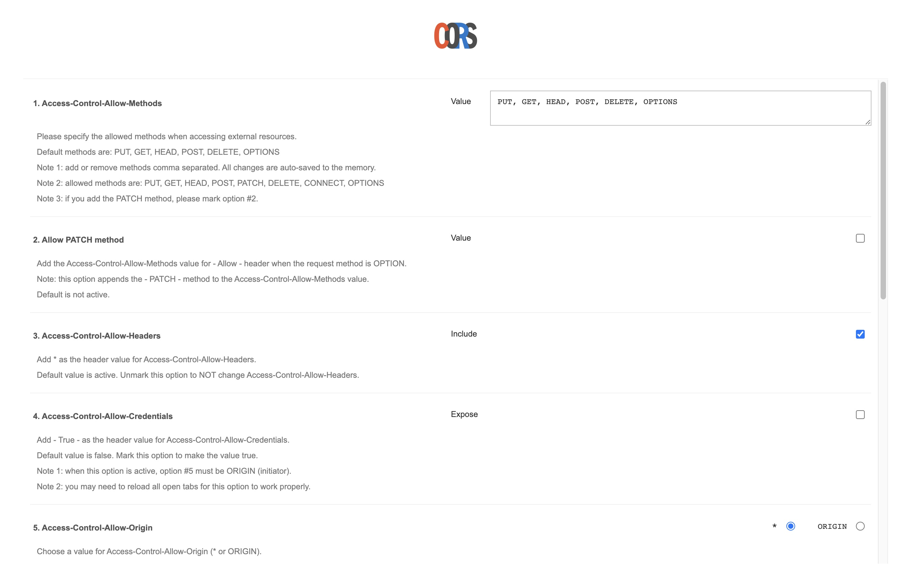

# ReactDownload

- ✨ **This workspace has been generated by [Nx, a Smart, fast and extensible build system.](https://nx.dev)** ✨
- ✨ **Credit: Core functionality is taken from this [blog.](https://huynvk.dev/blog/download-files-and-zip-them-in-your-browsers-using-javascript)** ✨

## Requirements

- Node >=16.0.0
- yarn
- Chrome
- [Chrome CORS extension](https://chrome.google.com/webstore/detail/allow-cors-access-control/lhobafahddgcelffkeicbaginigeejlf?hl=en)

## Development server

- Run `yarn && yarn start` for a dev server.
- Navigate to http://localhost:4200/.
- The app will automatically reload if you change any of the source files.

## Links to NPM packages

- [bluebird](https://www.npmjs.com/package/bluebird)
- [jszip](https://www.npmjs.com/package/jszip)
- [FileSaver](https://github.com/eligrey/FileSaver.js)

## Links to free image generator sites (downloadable via chrome cors extension):

- https://picsum.photos
- https://via.placeholder.com/600/771796

## Links to free wav sample sites (downloadable via chrome cors extension):

- https://freewavesamples.com/
- https://file-examples.com/index.php/sample-audio-files/sample-wav-download/

## Chrome cors extension setting:



## Change log

### 4/6/2023

- Replaced fetch with axios
- Axios gets are cached correctly by axios-request-intercepter
- Chrome cors extension must be on for ALL downloads including images;
- Previously, fetching image must have the extension off. Now it is on for all.
- To test for failure cases, toggle the extension off

### 4/7/2023

- mock axios in unit tests
- set node engine version to >=16.0.0

### 4/10/2023

- bump avaya neo-react version to 0.8.6

### 4/11/2023

- achieve 100% test coverage

```
------------------|---------|----------|---------|---------|-------------------
File              | % Stmts | % Branch | % Funcs | % Lines | Uncovered Line #s
------------------|---------|----------|---------|---------|-------------------
All files         |     100 |      100 |     100 |     100 |
 src              |     100 |      100 |     100 |     100 |
  cached-axios.ts |     100 |      100 |     100 |     100 |
 src/api          |     100 |      100 |     100 |     100 |
  download-zip.ts |     100 |      100 |     100 |     100 |
 src/app          |     100 |      100 |     100 |     100 |
  app.tsx         |     100 |      100 |     100 |     100 |
  helper.ts       |     100 |      100 |     100 |     100 |
------------------|---------|----------|---------|---------|-------------------
```
